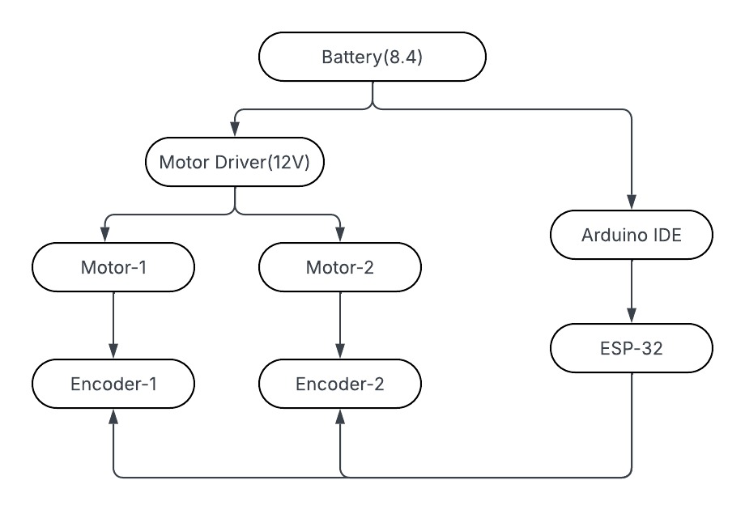
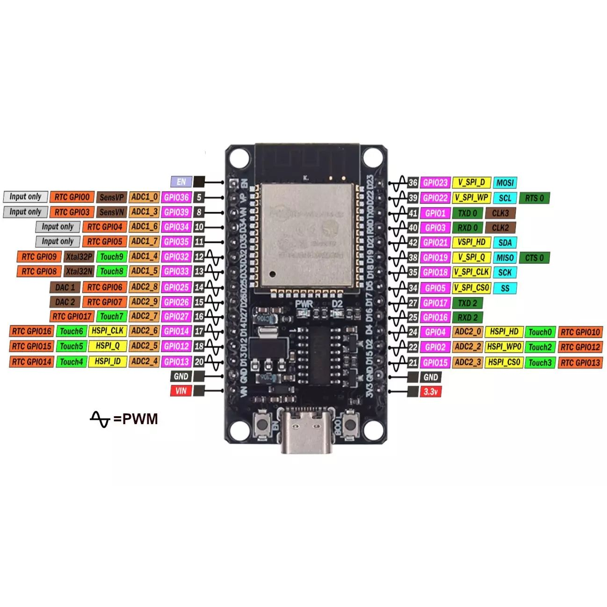
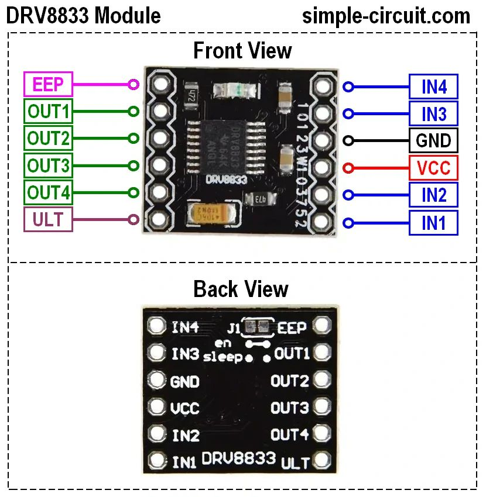
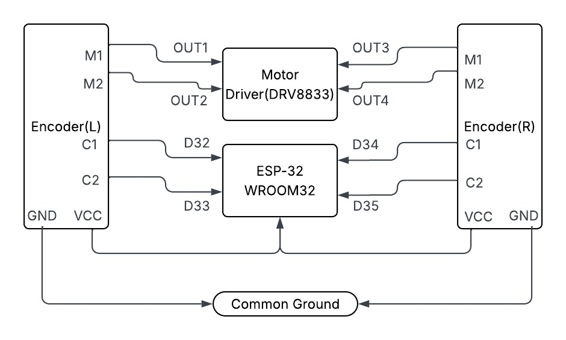

# ESP32 Rover — Motor & Encoder Development Sketches

---

## System Overview



---

## Hardware Pinouts

### ESP32 WROOM32



> GPIO 34, 35, 36, 39 are **input-only** — no internal pull-up, no output capability.

---

### DRV8833 Motor Driver



---

## Encoder wiring 



---

## Step 1 — Motor Test

```cpp
// Define the control inputs
#define MOT_A1_PIN 25
#define MOT_A2_PIN 26
#define MOT_B1_PIN 27
#define MOT_B2_PIN 14

void setup(void)
{
  // Set all the motor control inputs to OUTPUT
  pinMode(MOT_A1_PIN, OUTPUT);
  pinMode(MOT_A2_PIN, OUTPUT);
  pinMode(MOT_B1_PIN, OUTPUT);
  pinMode(MOT_B2_PIN, OUTPUT);

  // Turn off motors - Initial state
  digitalWrite(MOT_A1_PIN, LOW);
  digitalWrite(MOT_A2_PIN, LOW);
  digitalWrite(MOT_B1_PIN, LOW);
  digitalWrite(MOT_B2_PIN, LOW);

  // Initialize the serial UART at 9600 baud
  Serial.begin(9600);
}

void loop(void)
{
  // Generate a fixed motion sequence to demonstrate the motor modes.

  // Ramp speed up.
  for (int i = 0; i < 11; i++) {
    spin_and_wait(25*i, 25*i, 500);
  }
  // Full speed forward.
  spin_and_wait(255,255,2000);

  // Ramp speed into full reverse.
  for (int i = 0; i < 21 ; i++) {
    spin_and_wait(255 - 25*i, 255 - 25*i, 500);
  }

  // Full speed reverse.
  spin_and_wait(-255,-255,2000);

  // Stop.
  spin_and_wait(0,0,2000);

  // Full speed, forward, turn, reverse, and turn for a two-wheeled base.
  spin_and_wait(255, 255, 2000);
  spin_and_wait(0, 0, 1000);
  spin_and_wait(-255, 255, 2000);
  spin_and_wait(0, 0, 1000);
  spin_and_wait(-255, -255, 2000);
  spin_and_wait(0, 0, 1000);
  spin_and_wait(255, -255, 2000);
  spin_and_wait(0, 0, 1000);
}

/// Set the current on a motor channel using PWM and directional logic.
///
/// \param pwm    PWM duty cycle ranging from -255 full reverse to 255 full forward
/// \param IN1_PIN  pin number xIN1 for the given channel
/// \param IN2_PIN  pin number xIN2 for the given channel
void set_motor_pwm(int pwm, int IN1_PIN, int IN2_PIN)
{
  if (pwm < 0) {  // reverse speeds
    analogWrite(IN1_PIN, -pwm);
    digitalWrite(IN2_PIN, LOW);

  } else { // stop or forward
    digitalWrite(IN1_PIN, LOW);
    analogWrite(IN2_PIN, pwm);
  }
}

/// Set the current on both motors.
///
/// \param pwm_A  motor A PWM, -255 to 255
/// \param pwm_B  motor B PWM, -255 to 255
void set_motor_currents(int pwm_A, int pwm_B)
{
  set_motor_pwm(pwm_A, MOT_A1_PIN, MOT_A2_PIN);
  set_motor_pwm(pwm_B, MOT_B1_PIN, MOT_B2_PIN);

  // Print a status message to the console.
  Serial.print("Set motor A PWM = ");
  Serial.print(pwm_A);
  Serial.print(" motor B PWM = ");
  Serial.println(pwm_B);
}

/// Simple primitive for the motion sequence to set a speed and wait for an interval.
///
/// \param pwm_A  motor A PWM, -255 to 255
/// \param pwm_B  motor B PWM, -255 to 255
/// \param duration delay in milliseconds
void spin_and_wait(int pwm_A, int pwm_B, int duration)
{
  set_motor_currents(pwm_A, pwm_B);
  delay(duration);
}
```

**Pin Configuration**


| Signal | GPIO |
|--------|------|
| Motor A IN1 | 25 |
| Motor A IN2 | 26 |
| Motor B IN1 | 27 |
| Motor B IN2 | 14 |

---

## Step 2 — Checking Encoder Ticks by Hand

```cpp
#define LEFT_ENC_A  32
#define LEFT_ENC_B  33
#define RIGHT_ENC_A 34
#define RIGHT_ENC_B 35

volatile int32_t left_count  = 0;
volatile int32_t right_count = 0;

void IRAM_ATTR leftISR() {
    if (digitalRead(LEFT_ENC_B)) left_count++;
    else                         left_count--;
}

void IRAM_ATTR rightISR() {
    if (digitalRead(RIGHT_ENC_B)) right_count++;
    else                          right_count--;
}

void setup() {
    Serial.begin(115200);

    pinMode(LEFT_ENC_A,  INPUT_PULLUP);
    pinMode(LEFT_ENC_B,  INPUT_PULLUP);
    pinMode(RIGHT_ENC_A, INPUT_PULLUP);
    pinMode(RIGHT_ENC_B, INPUT_PULLUP);

    attachInterrupt(digitalPinToInterrupt(LEFT_ENC_A),  leftISR,  RISING);
    attachInterrupt(digitalPinToInterrupt(RIGHT_ENC_A), rightISR, RISING);

    Serial.println("Spin wheels by hand — watching ticks:");
}

void loop() {
    Serial.printf("L: %6d  |  R: %6d\n", left_count, right_count);
    delay(100);
}
```

**Pin Configuration**


| Signal | GPIO |
|--------|------|
| Left Encoder A (interrupt) | 32 |
| Left Encoder B (direction) | 33 |
| Right Encoder A (interrupt) | 34 |
| Right Encoder B (direction) | 35 |

> GPIO 34/35 are input-only on ESP32 — `INPUT_PULLUP` has no effect. Add external 10 kΩ pull-ups if signal is noisy.

---

## Step 3 — Motor Encoder Code

```cpp
// ─────────────────────────────────────────
// N20 298:1 Encoder Count Test
// Motor Driver: IN1-4 on 25,26,27,14
// Encoders: Left A/B, Right A/B
// ─────────────────────────────────────────

// Motor Driver Pins
#define MOT_A1_PIN  25
#define MOT_A2_PIN  26
#define MOT_B1_PIN  27
#define MOT_B2_PIN  14

// Encoder Pins — assign free GPIO pins
#define LEFT_ENC_A  32    // interrupt capable
#define LEFT_ENC_B  33    // direction
#define RIGHT_ENC_A 34    // interrupt capable (input only on ESP32)
#define RIGHT_ENC_B 35    // direction        (input only on ESP32)

// N20 298:1 @ 7 PPR motor shaft
#define MOTOR_PPR       7
#define GEAR_RATIO      298
#define COUNTS_PER_REV  (MOTOR_PPR * GEAR_RATIO)   // = 2086 (single edge)
// For quadrature 4x: 2086 * 4 = 8344

// ─────────────────────────────────────────
// GLOBALS
// ─────────────────────────────────────────
volatile int32_t left_count  = 0;
volatile int32_t right_count = 0;

int32_t left_prev  = 0;
int32_t right_prev = 0;

// ─────────────────────────────────────────
// ISRs — single edge (RISING on A, B = direction)
// ─────────────────────────────────────────
void IRAM_ATTR leftISR() {
    if (digitalRead(LEFT_ENC_B))  left_count++;
    else                          left_count--;
}

void IRAM_ATTR rightISR() {
    if (digitalRead(RIGHT_ENC_B)) right_count++;
    else                          right_count--;
}

// ─────────────────────────────────────────
// MOTOR CONTROL  (simple digitalWrite, no PWM)
// ─────────────────────────────────────────
void motorLeft(int dir) {
    // dir: 1=forward, -1=backward, 0=stop
    if      (dir > 0) { digitalWrite(MOT_A1_PIN, HIGH); digitalWrite(MOT_A2_PIN, LOW);  }
    else if (dir < 0) { digitalWrite(MOT_A1_PIN, LOW);  digitalWrite(MOT_A2_PIN, HIGH); }
    else              { digitalWrite(MOT_A1_PIN, LOW);  digitalWrite(MOT_A2_PIN, LOW);  }
}

void motorRight(int dir) {
    if      (dir > 0) { digitalWrite(MOT_B1_PIN, HIGH); digitalWrite(MOT_B2_PIN, LOW);  }
    else if (dir < 0) { digitalWrite(MOT_B1_PIN, LOW);  digitalWrite(MOT_B2_PIN, HIGH); }
    else              { digitalWrite(MOT_B1_PIN, LOW);  digitalWrite(MOT_B2_PIN, LOW);  }
}

void motorsStop() {
    motorLeft(0);
    motorRight(0);
}

// ─────────────────────────────────────────
// SETUP
// ─────────────────────────────────────────
void setup() {
    Serial.begin(115200);
    delay(1000);
    Serial.println("=== N20 298:1 Encoder Count Test ===");
    Serial.printf("Expected counts per wheel rev (1x): %d\n", COUNTS_PER_REV);
    Serial.printf("Expected counts per wheel rev (4x): %d\n", COUNTS_PER_REV * 4);

    // Motor pins
    pinMode(MOT_A1_PIN, OUTPUT);
    pinMode(MOT_A2_PIN, OUTPUT);
    pinMode(MOT_B1_PIN, OUTPUT);
    pinMode(MOT_B2_PIN, OUTPUT);
    motorsStop();

    // Encoder pins
    pinMode(LEFT_ENC_A,  INPUT_PULLUP);
    pinMode(LEFT_ENC_B,  INPUT_PULLUP);
    pinMode(RIGHT_ENC_A, INPUT_PULLUP);   // Note: GPIO34/35 are input-only, no PULLUP on ESP32
    pinMode(RIGHT_ENC_B, INPUT_PULLUP);   // add external 10k pullup if unreliable

    attachInterrupt(digitalPinToInterrupt(LEFT_ENC_A),  leftISR,  RISING);
    attachInterrupt(digitalPinToInterrupt(RIGHT_ENC_A), rightISR, RISING);
}

// ─────────────────────────────────────────
// LOOP — print every 500ms + spin test
// ─────────────────────────────────────────
unsigned long last_print = 0;
unsigned long test_start = 0;
bool test_running = false;
int  test_phase   = 0;   // 0=idle, 1=fwd, 2=stop

void loop() {

    // ── Serial Commands ──────────────────
    if (Serial.available()) {
        char c = Serial.read();

        if (c == 'f') {
            Serial.println("\n>> Forward — spin 1 revolution, watch counts...");
            left_count  = 0;
            right_count = 0;
            test_start  = millis();
            test_running = true;
            test_phase   = 1;
            motorLeft(1);
            motorRight(1);
        }
        if (c == 'b') {
            Serial.println("\n>> Backward");
            left_count  = 0;
            right_count = 0;
            motorLeft(-1);
            motorRight(-1);
        }
        if (c == 's') {
            motorsStop();
            test_running = false;
            Serial.println("\n>> Stopped");
            Serial.printf("   Left  count: %d  (%.2f revs)\n",
                left_count, (float)left_count / COUNTS_PER_REV);
            Serial.printf("   Right count: %d  (%.2f revs)\n",
                right_count, (float)right_count / COUNTS_PER_REV);
        }
        if (c == 'r') {
            left_count  = 0;
            right_count = 0;
            Serial.println(">> Counts reset to 0");
        }
    }

    // ── Auto-stop after 3 seconds (one rough revolution at 60 RPM) ──
    // 60 RPM → 1 rev/sec → 3 sec = ~3 revs for safety margin
    if (test_running && test_phase == 1 && millis() - test_start > 3000) {
        motorsStop();
        test_running = false;
        test_phase   = 2;
        Serial.println("\n>> Auto-stopped after 3s");
        Serial.printf("   Left  count: %d  |  expected ~%d  |  revs: %.2f\n",
            left_count,  COUNTS_PER_REV * 3, (float)left_count  / COUNTS_PER_REV);
        Serial.printf("   Right count: %d  |  expected ~%d  |  revs: %.2f\n",
            right_count, COUNTS_PER_REV * 3, (float)right_count / COUNTS_PER_REV);
    }

    // ── Periodic live print every 500ms ──
    if (millis() - last_print > 500) {
        last_print = millis();
        int32_t lc = left_count;
        int32_t rc = right_count;
        int32_t l_delta = lc - left_prev;
        int32_t r_delta = rc - right_prev;
        left_prev  = lc;
        right_prev = rc;

        // RPM estimate from delta (delta counts in 0.5s)
        float left_rpm  = ((float)l_delta / COUNTS_PER_REV) * 120.0;  // *120 = /0.5s * 60s
        float right_rpm = ((float)r_delta / COUNTS_PER_REV) * 120.0;

        Serial.printf("[%6lums]  L: %6d (%5.1f RPM)  |  R: %6d (%5.1f RPM)  |  L_rev: %.3f  R_rev: %.3f\n",
            millis(), lc, left_rpm, rc, right_rpm,
            (float)lc / COUNTS_PER_REV,
            (float)rc / COUNTS_PER_REV);
    }
}
```

**Pin Configuration**


| Signal | GPIO |
|--------|------|
| Motor A IN1 | 25 |
| Motor A IN2 | 26 |
| Motor B IN1 | 27 |
| Motor B IN2 | 14 |
| Left Encoder A (interrupt) | 32 |
| Left Encoder B (direction) | 33 |
| Right Encoder A (interrupt) | 34 |
| Right Encoder B (direction) | 35 |

**Serial Commands**

| Key | Action |
|-----|--------|
| `f` | Reset counts → drive forward → auto-stop after 3 s |
| `b` | Reset counts → drive backward |
| `s` | Stop + print final count and revolutions |
| `r` | Reset counts to 0 |

---

## Step 4 — Motor Encoder Working

```cpp
// ─────────────────────────────────────────
// N20 298:1 Encoder Count Test + Tick Mechanism
// Motor Driver: IN1-4 on 25,26,27,14
// Encoders: Left A/B, Right A/B
// ─────────────────────────────────────────

// Motor Driver Pins
#define MOT_A1_PIN  25
#define MOT_A2_PIN  26
#define MOT_B1_PIN  27
#define MOT_B2_PIN  14

// Encoder Pins
#define LEFT_ENC_A  32    // interrupt capable
#define LEFT_ENC_B  33    // direction
#define RIGHT_ENC_A 34    // interrupt capable (input only on ESP32)
#define RIGHT_ENC_B 35    // direction        (input only on ESP32)

// N20 298:1 @ 7 PPR motor shaft
#define MOTOR_PPR       7
#define GEAR_RATIO      298
#define COUNTS_PER_REV  (MOTOR_PPR * GEAR_RATIO)   // = 2086

// Tick milestones (per wheel)
#define QUARTER_REV     (COUNTS_PER_REV / 4)       // 521
#define HALF_REV        (COUNTS_PER_REV / 2)       // 1043
#define THREEQ_REV      ((COUNTS_PER_REV * 3) / 4) // 1565
#define FULL_REV        COUNTS_PER_REV             // 2086

// ─────────────────────────────────────────
// GLOBALS
// ─────────────────────────────────────────
volatile int32_t left_count  = 0;
volatile int32_t right_count = 0;

int32_t left_prev  = 0;
int32_t right_prev = 0;

// Tick mechanism state — tracks revolutions completed
int32_t left_revs  = 0;
int32_t right_revs = 0;

// Last milestone flag (so we don't re-print)
int left_last_milestone  = 0;   // 0=none, 1=quarter, 2=half, 3=3/4
int right_last_milestone = 0;

// ─────────────────────────────────────────
// ISRs
// ─────────────────────────────────────────
void IRAM_ATTR leftISR() {
    if (digitalRead(LEFT_ENC_B))  left_count++;
    else                          left_count--;
}

void IRAM_ATTR rightISR() {
    if (digitalRead(RIGHT_ENC_B)) right_count--;
    else                          right_count++;
}

// ─────────────────────────────────────────
// MOTOR CONTROL
// ─────────────────────────────────────────
void motorLeft(int dir) {
    if      (dir > 0) { digitalWrite(MOT_A1_PIN, HIGH); digitalWrite(MOT_A2_PIN, LOW);  }
    else if (dir < 0) { digitalWrite(MOT_A1_PIN, LOW);  digitalWrite(MOT_A2_PIN, HIGH); }
    else              { digitalWrite(MOT_A1_PIN, LOW);  digitalWrite(MOT_A2_PIN, LOW);  }
}

void motorRight(int dir) {
    if      (dir > 0) { digitalWrite(MOT_B1_PIN, HIGH); digitalWrite(MOT_B2_PIN, LOW);  }
    else if (dir < 0) { digitalWrite(MOT_B1_PIN, LOW);  digitalWrite(MOT_B2_PIN, HIGH); }
    else              { digitalWrite(MOT_B1_PIN, LOW);  digitalWrite(MOT_B2_PIN, LOW);  }
}

void motorsStop() {
    motorLeft(0);
    motorRight(0);
}

// ─────────────────────────────────────────
// TICK MECHANISM — checks each wheel separately
// ─────────────────────────────────────────
void checkLeftTicks() {
    int32_t abs_count = abs(left_count);

    if (abs_count >= FULL_REV) {
        left_revs++;
        Serial.println("┌────────────────────────────────┐");
        Serial.printf ("│ [LEFT]  FULL REV #%d done!       │\n", left_revs);
        Serial.printf ("│ Count was: %d → resetting to 0  │\n", left_count);
        Serial.println("└────────────────────────────────┘");
        left_count = 0;
        left_last_milestone = 0;
    }
    else if (abs_count >= THREEQ_REV && left_last_milestone < 3) {
        Serial.println("  [LEFT]  >> 3/4 revolution reached");
        left_last_milestone = 3;
    }
    else if (abs_count >= HALF_REV && left_last_milestone < 2) {
        Serial.println("  [LEFT]  >> Half revolution reached");
        left_last_milestone = 2;
    }
    else if (abs_count >= QUARTER_REV && left_last_milestone < 1) {
        Serial.println("  [LEFT]  >> Quarter revolution reached");
        left_last_milestone = 1;
    }
}

void checkRightTicks() {
    int32_t abs_count = abs(right_count);

    if (abs_count >= FULL_REV) {
        right_revs++;
        Serial.println("┌────────────────────────────────┐");
        Serial.printf ("│ [RIGHT] FULL REV #%d done!       │\n", right_revs);
        Serial.printf ("│ Count was: %d → resetting to 0  │\n", right_count);
        Serial.println("└────────────────────────────────┘");
        right_count = 0;
        right_last_milestone = 0;
    }
    else if (abs_count >= THREEQ_REV && right_last_milestone < 3) {
        Serial.println("  [RIGHT] >> 3/4 revolution reached");
        right_last_milestone = 3;
    }
    else if (abs_count >= HALF_REV && right_last_milestone < 2) {
        Serial.println("  [RIGHT] >> Half revolution reached");
        right_last_milestone = 2;
    }
    else if (abs_count >= QUARTER_REV && right_last_milestone < 1) {
        Serial.println("  [RIGHT] >> Quarter revolution reached");
        right_last_milestone = 1;
    }
}

// ─────────────────────────────────────────
// SETUP
// ─────────────────────────────────────────
void setup() {
    Serial.begin(115200);
    delay(1000);
    Serial.println("\n=== N20 298:1 Encoder Test + Tick Mechanism ===");
    Serial.printf("1 revolution      = %d ticks\n", FULL_REV);
    Serial.printf("Quarter rev (1/4) = %d ticks\n", QUARTER_REV);
    Serial.printf("Half rev    (1/2) = %d ticks\n", HALF_REV);
    Serial.printf("Three-quarter rev = %d ticks\n", THREEQ_REV);
    Serial.println("\nCommands: f=fwd  b=back  s=stop  r=reset\n");

    // Motor pins
    pinMode(MOT_A1_PIN, OUTPUT);
    pinMode(MOT_A2_PIN, OUTPUT);
    pinMode(MOT_B1_PIN, OUTPUT);
    pinMode(MOT_B2_PIN, OUTPUT);
    motorsStop();

    // Encoder pins
    pinMode(LEFT_ENC_A,  INPUT_PULLUP);
    pinMode(LEFT_ENC_B,  INPUT_PULLUP);
    pinMode(RIGHT_ENC_A, INPUT_PULLUP);
    pinMode(RIGHT_ENC_B, INPUT_PULLUP);

    attachInterrupt(digitalPinToInterrupt(LEFT_ENC_A),  leftISR,  RISING);
    attachInterrupt(digitalPinToInterrupt(RIGHT_ENC_A), rightISR, RISING);
}

// ─────────────────────────────────────────
// LOOP
// ─────────────────────────────────────────
unsigned long last_print = 0;
unsigned long test_start = 0;
bool test_running = false;
int  test_phase   = 0;

void loop() {

    // ── Serial Commands ──
    if (Serial.available()) {
        char c = Serial.read();

        if (c == 'f') {
            Serial.println("\n>> Forward");
            left_count  = 0;  right_count = 0;
            left_revs   = 0;  right_revs  = 0;
            left_last_milestone = 0;  right_last_milestone = 0;
            test_start  = millis();
            test_running = true;
            test_phase   = 1;
            motorLeft(1);
            motorRight(1);
        }
        if (c == 'b') {
            Serial.println("\n>> Backward");
            left_count  = 0;  right_count = 0;
            left_revs   = 0;  right_revs  = 0;
            left_last_milestone = 0;  right_last_milestone = 0;
            motorLeft(-1);
            motorRight(-1);
        }
        if (c == 's') {
            motorsStop();
            test_running = false;
            Serial.println("\n>> Stopped");
            Serial.printf("   Left  : %d ticks  |  %d full revs done\n",  left_count,  left_revs);
            Serial.printf("   Right : %d ticks  |  %d full revs done\n", right_count, right_revs);
        }
        if (c == 'r') {
            left_count  = 0;  right_count = 0;
            left_revs   = 0;  right_revs  = 0;
            left_last_milestone = 0;  right_last_milestone = 0;
            Serial.println(">> All counts reset to 0");
        }
    }

    // ── Auto-stop after 3 seconds ──
    if (test_running && test_phase == 1 && millis() - test_start > 3000) {
        motorsStop();
        test_running = false;
        test_phase   = 2;
        Serial.println("\n>> Auto-stopped after 3s");
        Serial.printf("   Left  : %d ticks remaining  |  %d full revs done\n",  left_count,  left_revs);
        Serial.printf("   Right : %d ticks remaining  |  %d full revs done\n", right_count, right_revs);
    }

    // ── Tick mechanism check (every loop) ──
    checkLeftTicks();
    checkRightTicks();

    // ── Periodic live print every 500ms ──
    if (millis() - last_print > 500) {
        last_print = millis();
        int32_t lc = left_count;
        int32_t rc = right_count;
        int32_t l_delta = lc - left_prev;
        int32_t r_delta = rc - right_prev;
        left_prev  = lc;
        right_prev = rc;

        float left_rpm  = ((float)l_delta / COUNTS_PER_REV) * 120.0;
        float right_rpm = ((float)r_delta / COUNTS_PER_REV) * 120.0;

        Serial.printf("[%6lums]  L: %5d (%5.1f RPM, revs:%d)  |  R: %5d (%5.1f RPM, revs:%d)\n",
            millis(), lc, left_rpm, left_revs, rc, right_rpm, right_revs);
    }
}
```

**Pin Configuration**


| Signal | GPIO |
|--------|------|
| Motor A IN1 | 25 |
| Motor A IN2 | 26 |
| Motor B IN1 | 27 |
| Motor B IN2 | 14 |
| Left Encoder A (interrupt) | 32 |
| Left Encoder B (direction) | 33 |
| Right Encoder A (interrupt) | 34 |
| Right Encoder B (direction) | 35 |

**Tick Milestones**

| Milestone | Ticks |
|-----------|-------|
| Quarter rev | 521 |
| Half rev | 1043 |
| Three-quarter rev | 1565 |
| Full rev | 2086 |

**Serial Commands**

| Key | Action |
|-----|--------|
| `f` | Reset all → drive forward → auto-stop after 3 s |
| `b` | Reset all → drive backward |
| `s` | Stop + print ticks + full revs done |
| `r` | Reset all counts and rev counters to 0 |
